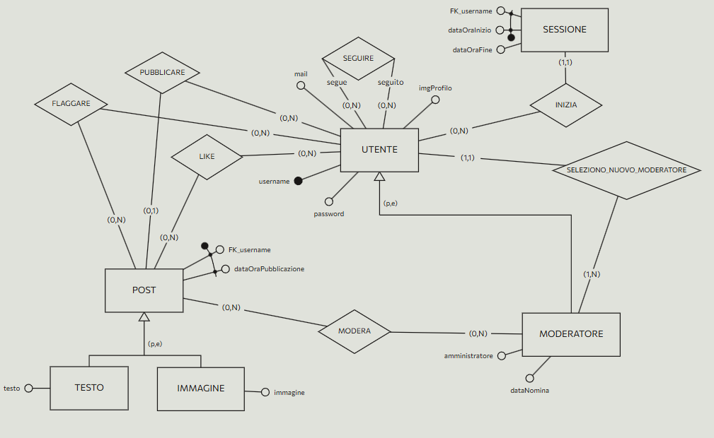
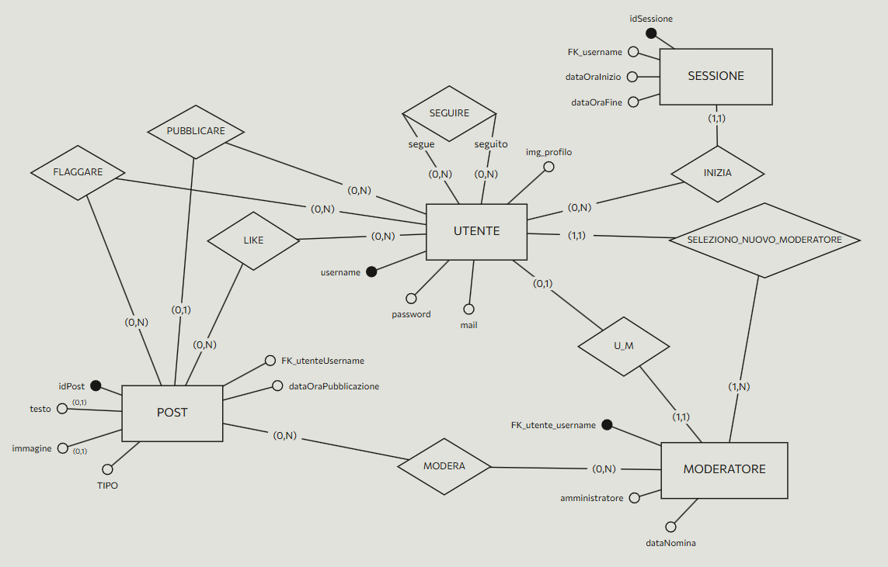

# DOCUMENTAZIONE PER IL PROGETTO “FOTOGRAM”
* Studente: Fokou Tchinda Mychael Ange
* Matricola: 29159A

## PROGETTAZIONE CONCETTUALE

Considerare il seguente diagramma ER 




### SCELTE PROGETTUALI

- l’amministratore è uno solo, quindi è inserito come attributo booleano in MODERATORE

### VINCOLI AGGIUNTIVI

- un UTENTE che ha 3 post moderati nell'arco di 30 giorni non può creare nuovi post  
- un MODERATORE con amministratore = false non può selezionare un nuovo MODERATORE  
- l’amministratore è l'unico utente che ha valore null in dataNomina, dato che è lui che seleziona i moderatori 


### 

### 

# PROGETTAZIONE LOGICA (RISTRUTTURAZIONE)

Sono descritte le modifiche al progetto per ciascuna delle fasi della ristrutturazione dello schema ER  



### RIDONDANZE:

Non vengono introdotte ridondanze

### ELIMINAZIONE DELLE GERARCHIE:

- La gerarchia di POST viene eliminata accorpando le entità figlie all'entità genitore perché gli accessi a entità genitore e figlie sono contestuali, la generalizzazione è parziale e non ci sono associazioni che coinvolgono le sole entità figlie. Viene aggiunto un attributo tipo a POST per definire il tipo di post  
- La gerarchia di UTENTE viene eliminata sostituendola con una relationship U\_M tra figlia e genitore perchè gli accessi a entità genitore e figlie non sono contestuali, la generalizzazione è parziale e ci sono associazioni che coinvolge la sole entità figlia. Ho aggiunto la chiave esterna username riferita all’attributo username di UTENTE

### SCELTE DEGLI IDENTIFICATORI PRINCIPALI

- per POST si produce chiave artificiale per evitare la coppia composta da dataOraPubblicazione e la chiave esterna username riferita a UTENTE  
- per SESSIONE si produce chiave artificiale per evitare la coppia composta da dataOraInizio e la chiave esterna username riferita a UTENTE  
- per MODERATORE si assume come identificatore la chiave esterna username riferita a UTENTE  
- per UTENTE si conferma username

# PROGETTAZIONE LOGICA (MODELLO RELAZIONALE)

Legenda: <u>chiave primaria</u>, *chiave esterna*, **attributi unici**, --permette null–

* UTENTE (<u>username</u>, **password**, **mail,** imgProfilo)

* POST (tipo, --testo--, --immagine--, *usernameCreatore*, dataOraPubblicazione, <u>idPost</u>)  
  * FOREIGN KEY(usernameCreatore) references to UTENTE(username)  
* SESSIONE (dataOraInizio, --dataOraFine--, *username*, <u>idSessione</u>)  
  * FOREIGN KEY(username) references to UTENTE(username)  
* MODERATORE (--dataNomina--, <u>*username*</u>, amministratore)  
  * FOREIGN KEY(username) references to UTENTE(username)  
* LIKE (<u>*idPost*</u>, <u>*username*</u>)  
  * FOREIGN KEY(username) references to UTENTE(username)  
  * FOREIGN KEY(idPost ) references to POST(idPost )  
* SEGUIRE (<u>*segue*</u>, <u>*seguito*</u>)  
  * FOREIGN KEY(segue) references to UTENTE(username)  
  * FOREIGN KEY(seguito) references to UTENTE(username)  
* MODERA (<u>*username*</u>, <u>*idPost*</u>)  
  * FOREIGN KEY(username) references to MODERATORE(username)  
  * FOREIGN KEY(idPost) references to POST(idPost *)*  
* FLAGGARE (<u>*username*</u>, <u>*idPost*</u>)  
  * FOREIGN KEY(username) references to UTENTE(username)  
  * FOREIGN KEY(idPost) references to POST(idPost)

## Progettazione API e query corrispondenti

### Endpoint: /register

#### POST

Registra utente, altrimenti non può autenticarsi

PRIVILEGIO: UTENTE QUALSIASI

Headers:

- bearer (string)

Request body:

```json
{
  "username": "string",
  "password": "string",
  "mail": "string"
}
```

Queries: `INSERT INTO Utente (username, password, mail) VALUES ($1, $2, $3) RETURNING username;` 

Responses:

- 200, utente creato
- 400, parameters missing or invalid
- 500, query error / business logic

---

### Endpoint: /login

#### POST

Accedi al social network con un account registrato

PRIVILEGIO: UTENTE QUALSIASI

Headers:

- bearer (string)

Request body:

```json
{
  "username": "string",
  "password": "string"
}
```

Queries: `SELECT password FROM Utente WHERE username = $1;`

`INSERT INTO Sessione(idsessione, username , dataOraFine) VALUES($1, $2, $3);` (creazione sessione) 

Responses:

- 200, restituisce **token** & **refresh token**
- 400, parametri mancanti o non validi
- 401, credenziali errate / username inesistente
- 500, query error / business logic

---

### Endpoint: /logout

#### POST

Scollega utente 

PRIVILEGIO: UTENTE QUALSIASI


Headers:

- bearer (string)

Queries: `UPDATE Sessione SET dataOraFine = CURRENT_TIMESTAMP::timestamp WHERE username = $1 AND idSessione = $2;` 

Responses:

- 200, utente scollegato
- 400, token non presente o malformato
- 401, token non valido
- 500, errore durante il logout / query

---

### Endpoint: /refresh

#### POST

Rinfresca il token 

PRIVILEGIO: UTENTE QUALSIASI

Headers:

- bearer (string)

Request body:

```json
{
  "refresh": "string"
}
```

Queries: `SELECT * FROM Sessione WHERE idSessione = $1 AND username = $2 AND dataOraFine > CURRENT_TIMESTAMP;`

`UPDATE Sessione SET idSessione = $1, dataOraFine = $2 WHERE idSessione = $3;` (rigenera sessione) 

Responses:

- 200, nuovo token & refresh restituiti
- 400, token mancante / refresh malformato
- 401, refresh token non valido / sessione scaduta
- 500, errore aggiornamento sessione / business logic

---

### Endpoint: /admin/moderatore/{username}

#### POST

Promuove un utente a moderatore 

PRIVILEGIO: ADMIN

Headers:

- bearer (string)

Queries: `INSERT INTO Moderatore (username, datanomina) VALUES ($1, CURRENT_DATE) RETURNING *;` 

Responses:

- 201, moderatore creato
- 401, unauthorized (solo amministratori)
- 500, query error / business logic

#### DELETE

Rimuove un moderatore (solo per amministratori) 

Headers:

- bearer (string)

Queries: `DELETE FROM Moderatore WHERE username = $1 RETURNING *;` 

Responses:

- 200, moderatore eliminato
- 401, unauthorized
- 404, moderatore non trovato
- 500, query error / business logic

---

### Endpoint: /moderatore/moderatori

#### GET

Recupera la lista di tutti i moderatori 

PRIVILEGIO: MODERATORE

Headers:

- bearer (string)

Parameters:

- q (string) – filtro parziale su username
- size (int) – 1‑50 (default 20)
- page (int) – 0‑n (default 0)

Queries: `SELECT username, imgprofilo, datanomina, amministratore FROM moderatore JOIN utente USING(username) ORDER BY datanomina DESC LIMIT $1 OFFSET $2;` 

Responses:

- 200, restituisce risultati & paginazione
- 401, unauthorized (solo moderatori)
- 500, query error / business logic

---

### Endpoint: /moderatore/utenti

#### GET

Recupera la lista degli utenti moderati dallo user, con i relativi post moderati 

PRIVILEGIO: MODERATORE


Headers:

- bearer (string)

Parameters:

- q (string) – filtro username
- size (int) – 1‑50 (default 20)
- page (int)

Queries:

```sql
SELECT u.username, u.imgProfilo, json_agg(p.idPost) AS postModerati
FROM Modera m
JOIN Post p ON m.idPost = p.idPost
JOIN Utente u ON u.username = p.usernameCreatore
WHERE m.username = $1 AND LOWER(u.username) LIKE LOWER($2)
GROUP BY u.username, u.imgProfilo
ORDER BY u.username
LIMIT $3 OFFSET $4;
``` 

Responses:
* 200, restituisce risultati & paginazione
* 401, unauthorized
* 500, query error / business logic

---

### Endpoint: /moderatore/flagged

#### GET
Recupera tutti i post flaggati 

PRIVILEGIO: MODERATORE


Headers:
* bearer (string)

Parameters:
* size (int) – 1‑50 (default 20)
* page (int)

Queries:

```sql
SELECT DISTINCT p.idPost, p.usernameCreatore, TO\_CHAR(p.dataOraPubblicazione,'YYYY-MM-DD') AS dataPubblicazione, TO\_CHAR(p.dataOraPubblicazione,'HH24\:MI\:SS') AS oraPubblicazione, p.tipo, p.testo, p.immagine, u.imgProfilo AS imgProfiloCreatore, COUNT(f.username) AS flagCount FROM Post p JOIN Utente u ON u.username = p.usernameCreatore JOIN Flaggare f ON f.idPost = p.idPost GROUP BY p.idPost, u.imgProfilo, p.tipo, p.testo, p.immagine, p.dataOraPubblicazione LIMIT \$1 OFFSET \$2;
```


Responses:
* 200, restituisce risultati & paginazione
* 401, unauthorized (solo moderatori)
* 500, query error / business logic

---

### Endpoint: /moderatore/flagged/{idPost}

#### GET
Recupera le flag di un post specifico 

PRIVILEGIO: MODERATORE


Headers:
* bearer (string)

Queries:
```sql
SELECT p.idPost, p.usernameCreatore, TO_CHAR(p.dataOraPubblicazione,'YYYY-MM-DD') AS dataPubblicazione, TO_CHAR(p.dataOraPubblicazione,'HH24:MI:SS') AS oraPubblicazione, p.tipo, p.testo, p.immagine, u.imgProfilo AS imgProfiloCreatore, COUNT(f.username) AS flagCount, ARRAY_AGG(f.username) AS utentiFlagganti
FROM Post p
JOIN Utente u ON u.username = p.usernameCreatore
JOIN Flaggare f ON f.idPost = p.idPost
WHERE p.idPost = $1
GROUP BY p.idPost, u.imgProfilo, p.tipo, p.testo, p.immagine, p.dataOraPubblicazione;
``` 

Responses:
* 200, restituisce dettaglio post & flag
* 400, idPost non valido
* 401, unauthorized
* 404, post non trovato
* 500, query error / business logic

---

### Endpoint: /posts/{idPost}/moderazioni

#### POST
Modera un post specifico  

PRIVILEGIO: MODERATORE


Headers:
* bearer (string)

Queries:
`INSERT INTO Modera (username, idPost) VALUES ($1, $2) ON CONFLICT DO NOTHING RETURNING *;` 

Responses:
* 201, post moderato
* 200, post già moderato da questo user
* 400, idPost non valido
* 401, unauthorized
* 404, post non trovato
* 500, insert error / business logic

#### DELETE
Annulla la moderazione di un post  

Headers:
* bearer (string)

Queries:
`DELETE FROM Modera WHERE idPost = $1 RETURNING *;` 

Responses:
* 200, moderazione rimossa
* 400, idPost non valido
* 401, unauthorized
* 404, moderation entry non trovata
* 500, delete error / business logic

---

### Endpoint: /utenti

#### GET
Recupera tutti gli utenti non moderati 

PRIVILEGIO: UTENTE QUALSIASI

Headers:
* bearer (string)

Parameters:
* q (string) – filtro username
* size (int) – 1‑50 (default 20)
* page (int)

Queries:
`SELECT USERNAME, IMGPROFILO FROM UTENTE WHERE LOWER(USERNAME) LIKE LOWER($1) GROUP BY USERNAME LIMIT $2 OFFSET $3;` 

Responses:
* 200, restituisce risultati & paginazione
* 500, query error / business logic

---

### Endpoint: /utente (self)

#### DELETE
Elimina il proprio account utente 

PRIVILEGIO: UTENTE QUALSIASI

Headers:
* bearer (string)

Queries:
`DELETE FROM Utente WHERE username = $1 RETURNING *;` 

Responses:
* 200, user cancellato
* 404, user non trovato
* 500, query error / business logic

#### PATCH
Modifica la mail o l’immagine del profilo dell’utente 

Headers:
* bearer (string)

Request body (uno o entrambi i campi):
```json
{
  "mail": "string",     // deve contenere @
  "imgProfilo": "string" // url .jpg|.jpeg|.png|.gif
}
```

Queries: Aggiornamento dinamico su Utente (mail / imgProfilo) in base ai campi presenti.

Responses:

- 200, user aggiornato
- 400, campi mancanti / invalidi
- 500, query error / business logic

---

### Endpoint: /utente/{username}

#### GET

Profilo utente con elenco dei suoi post non moderati 

PRIVILEGIO: UTENTE QUALSIASI

Headers:

- bearer (string)

Queries:

```sql
SELECT u.username, u.imgProfilo, json_agg(p.idPost) AS postIds
FROM Utente u
LEFT JOIN Post p ON p.usernameCreatore = u.username
LEFT JOIN Modera m ON m.idPost = p.idPost
WHERE u.username = $1 AND m.idPost IS NULL
GROUP BY u.username, u.imgProfilo;
```

Responses:
* 200, profilo con lista post
* 404, user non trovato
* 500, query error / business logic

---

### Endpoint: /utente/{username}/following

#### GET
Recupera la lista dei seguiti dell’utente 

PRIVILEGIO: UTENTE QUALSIASI

Headers:
* bearer (string)

Queries:
`SELECT seguito AS username FROM Seguire WHERE segue = $1;` 

Responses:
* 200, lista utenti seguiti
* 500, query error / business logic

### Endpoint: /utente/{username}/followers

#### GET
Recupera la lista dei follower dell’utente 

PRIVILEGIO: UTENTE QUALSIASI

Headers:
* bearer (string)

Queries:
`SELECT segue AS username FROM Seguire WHERE seguito = $1;` 

Responses:
* 200, lista follower
* 500, query error / business logic

---

### Endpoint: /utente/{username}/follow

#### POST
Segui un utente specifico 

PRIVILEGIO: UTENTE QUALSIASI

Headers:
* bearer (string)

Queries:
`INSERT INTO Seguire (segue, seguito) VALUES ($1, $2) ON CONFLICT DO NOTHING RETURNING *;` 

Responses:
* 201, now following user
* 200, already following user
* 400, self‑follow non consentito
* 404, user da seguire non trovato
* 500, query error / business logic

#### DELETE
Smetti di seguire un utente 

Headers:
* bearer (string)

Queries:
`DELETE FROM Seguire WHERE segue = $1 AND seguito = $2 RETURNING *;` 

Responses:
* 200, unfollowed successfully
* 404, relazione follow non trovata
* 400, self‑unfollow non consentito
* 500, query error / business logic

---

### Endpoint: /posts

#### GET
Recupera il feed di tutti i post 

PRIVILEGIO: UTENTE QUALSIASI

Headers:
* bearer (string)

Parameters:
* tipo (string) – filter per tipo (testo/immagine)
* size (int) – 1‑50 (default 10)
* page (int)

Queries:
Consulta Post + join Utente, MiPiace; esclusi post moderati.

Responses:
* 200, lista post & paginazione
* 500, query error / business logic

---

### Endpoint: /utente/{username}/posts

#### GET
Recupera tutti i post di un utente specifico 

PRIVILEGIO: UTENTE QUALSIASI

Headers:
* bearer (string)

Parameters:
* size, page

Queries: vedi codice in funzione getUserPosts.

Responses:
* 200, lista post & paginazione
* 500, query error / business logic

---

### Endpoint: /utente/{username}/post/{idPost}

#### GET
Recupera un post specifico di un utente 

PRIVILEGIO: UTENTE QUALSIASI

Headers:
* bearer (string)

Queries: select dettagli post + likes (esclusi moderati).

Responses:
* 200, post trovato
* 400, idPost non valido
* 404, post non trovato / moderato
* 500, query error

---

### Endpoint: /utente/post

#### POST
Crea un nuovo post

PRIVILEGIO: UTENTE QUALSIASI

Headers:
* bearer (string)

Request body (multipart/form‑data):
* **tipo**: "testo" | "immagine" (obbligatorio)
* **testo**: string (se tipo = testo)
* **immagine**: file (se tipo = immagine, form‑data field)

Queries:
Inserimento dinamico in Post (testo o immagine) con RETURNING *.

Responses:
* 201, post creato
* 400, parametri mancanti o invalidi
* 403, limite post (3 moderati) superato ultimi 30 giorni
* 401, unauthorized (non può postare per altro user)
* 500, insert error / business logic

---

### Endpoint: /utente/post/{idPost}

#### PATCH
Modifica un post specifico del proprio profilo 

PRIVILEGIO: UTENTE QUALSIASI

Headers:
* bearer (string)

Request body:
* Se post tipo **testo** → `{ "testo": "string" }`
* Se post tipo **immagine** → `{ "immagine": "string" }` (URL .jpg/.png/.gif)

Queries:
Update campo testo **oppure** immagine su Post.

Responses:
* 200, post aggiornato
* 400, campi invalidi / unsupported type
* 404, post non trovato o non owned
* 500, update error / business logic

#### DELETE
Elimina un post specifico 

Headers:
* bearer (string)

Queries:
`DELETE FROM Post WHERE idPost = $1 RETURNING *;`

Responses:
* 200, post eliminato
* 400, idPost non valido
* 401, unauthorized (utente diverso)
* 404, post non trovato
* 500, delete error / business logic

---

### Endpoint: /posts/{idPost}/like

#### POST
Aggiunge un like a un post 

PRIVILEGIO: UTENTE QUALSIASI

Headers:
* bearer (string)

Queries:
`INSERT INTO MiPiace (username, idPost) VALUES ($1, $2) ON CONFLICT DO NOTHING RETURNING *;` 

Responses:
* 201, post liked
* 200, post già likato
* 400, idPost non valido
* 403, post moderato
* 404, post non trovato
* 500, like insert error / business logic

#### DELETE
Rimuove un like da un post 

Headers:
* bearer (string)

Queries:
`DELETE FROM MiPiace WHERE username = $1 AND idPost = $2 RETURNING *;`

Responses:
* 200, like removed
* 404, like non trovato
* 403, post moderato
* 400, idPost non valido
* 500, delete error / business logic

---

### Endpoint: /posts/{idPost}/flag

#### POST
Aggiunge un flag a un post 

PRIVILEGIO: UTENTE QUALSIASI

Headers:
* bearer (string)

Queries:
`INSERT INTO Flaggare (username, idPost) VALUES ($1, $2) ON CONFLICT DO NOTHING RETURNING *;`

Responses:
* 201, post flaggato
* 200, già flaggato
* 403, post moderato
* 404, post non trovato
* 400, idPost non valido
* 500, insert error / business logic

#### DELETE
Rimuove un flag da un post 

Headers:
* bearer (string)

Queries:
`DELETE FROM Flaggare WHERE username = $1 AND idPost = $2 RETURNING *;`

Responses:
* 200, flag rimosso
* 404, flag non trovato
* 403, post moderato
* 400, idPost non valido
* 500, delete error / business logic

---